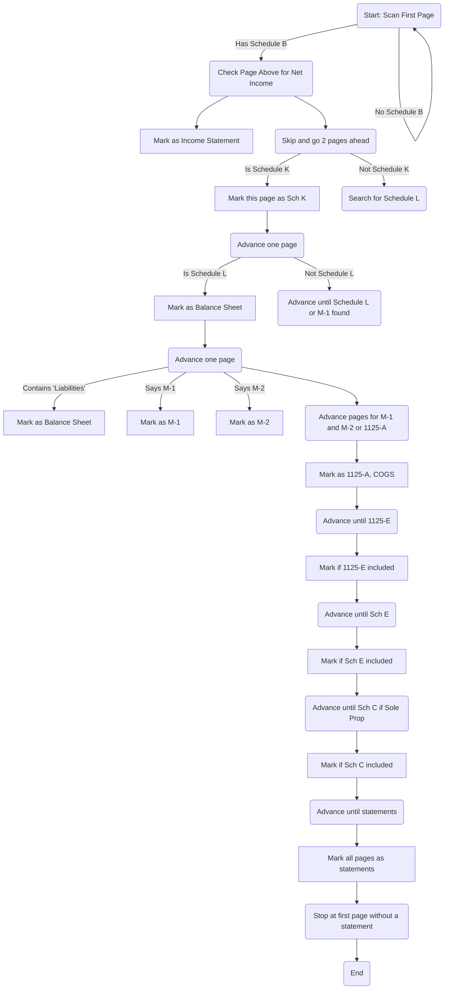

# Steps For The Computer to Process The Tax Return
## Phase 1 - Scan Whole Document to Indify What Pages to Extract
1. Scan First page, Check if there is Schdule B
   1. If there is Schedule B, Go Up One and See if that has Net Income. **Mark This Page as Income Statement**
   2. If there is not a Schedule B, Repeat steps 1 and 1.1
2. Skip over one page and go 2 pages ahead of Schedule B
   1. Determine if that is Schedule K
      1. If it is not Sch K, go back one page and keep going foward until you find Schedule L
      2. If it is Sch K proceed to Step 3 and **Mark This Page as Sch K**
3. Advance One page, and Determine if that contains Sch L
   1. If it is not Sch L, advance foward until you find Schedule L or Schedule M-1
   2. If it is Schedule L proceed to Step 4 and **Mark This Page as Balance Sheet**
4. Advance One page,
   1. if this page contains the string "Liabilities" Then **Mark This Page as Balance Sheet**
   2. if this page says M-1, Then **Mark This Page as M-1**
   3. if this page says M-1, Then **Mark This Page as M-2**
   4. Advance pages until you have found both M-1 and M-2 or 1125-A
5. Advance until you reach a page that contains 1125-A
   1. Mark this page with COGS
   2. Make note of the statement provided if applicable
6. Determine if the Returns Include a 1125-E
   1. Mark Accordingly
7. Determine if the Returns Include a Sch E(s)
   1. Mark Accordingly
8. Determine if the Returns Include a Sch C if Sole Prop
   1. Mark Accordingly
9. Advance Until you see statements
   1.  Mark all pages marked as statements
   2.  Stop at the first instance of a page without a statement

## Scanner Functions
1. Scan Pg (Pytesseract and Images)
2. Identify IS
3. Update Field with X
4. Record
5. Advance X Pages

## Chart

